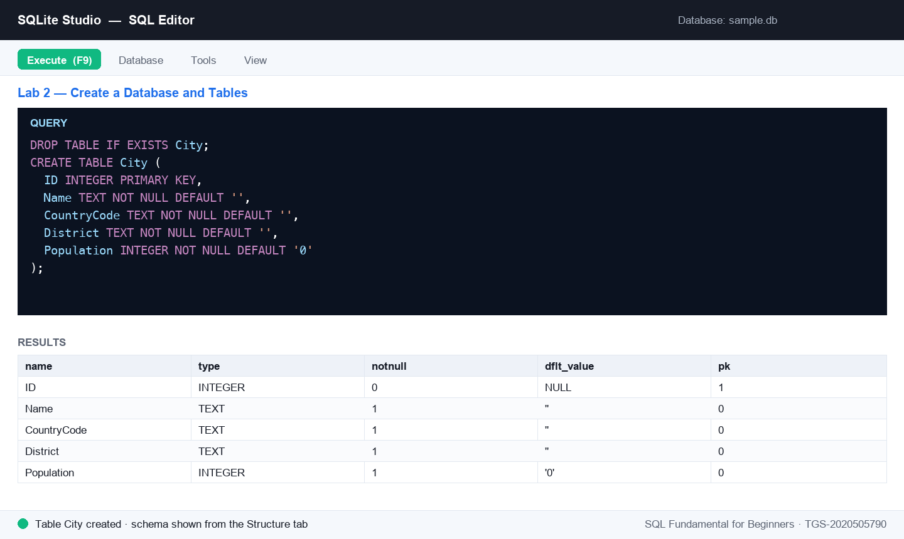
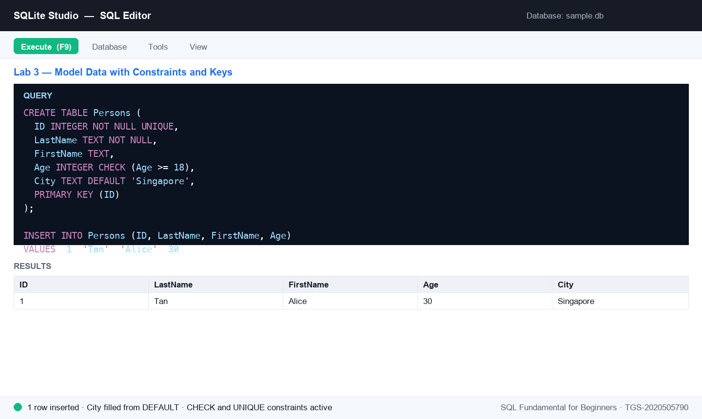
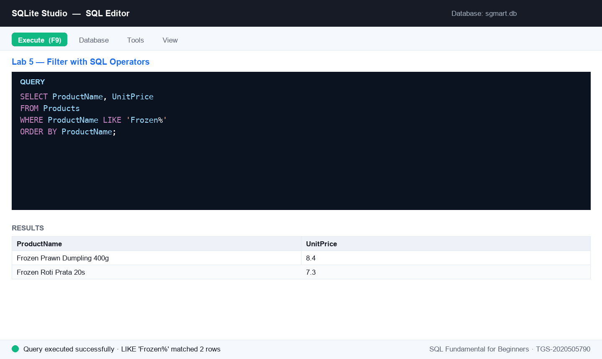
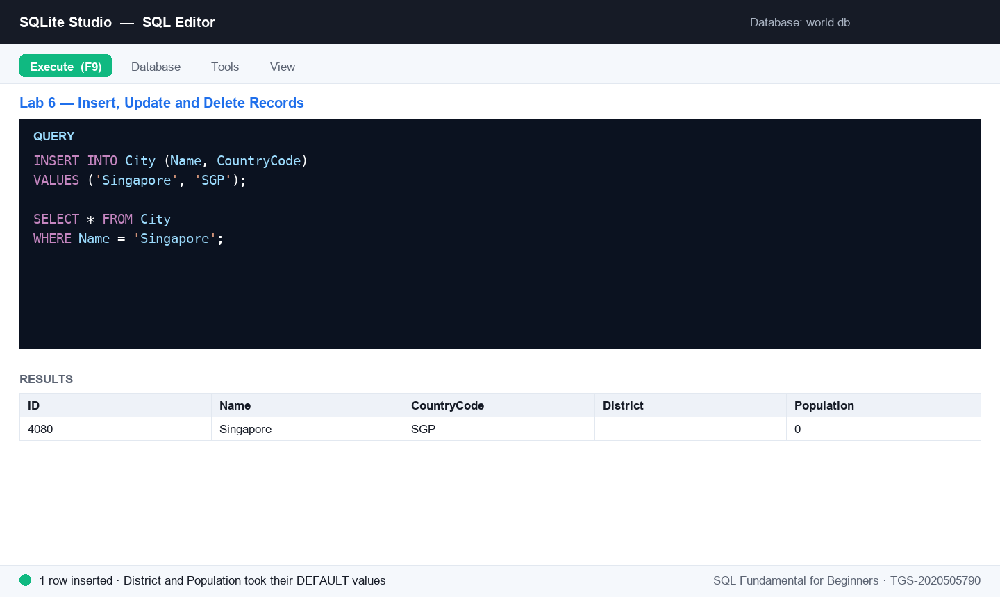
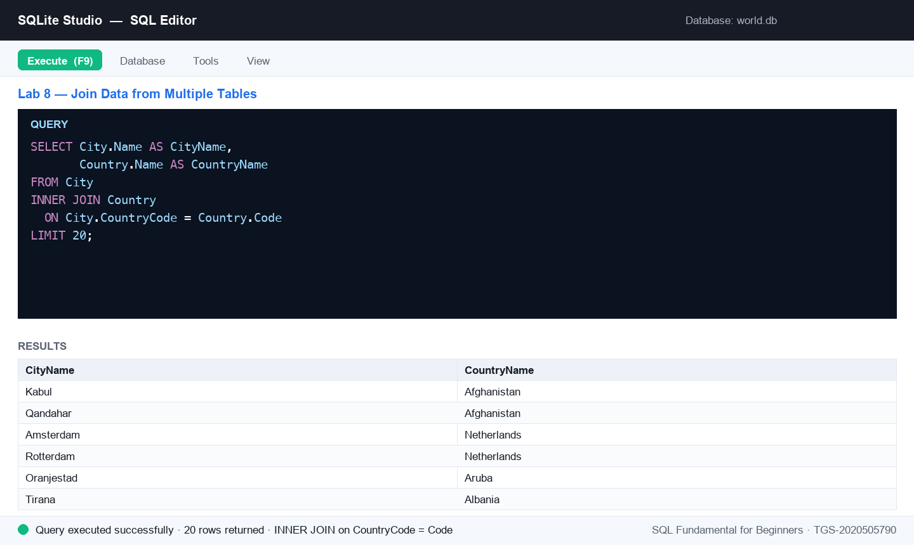
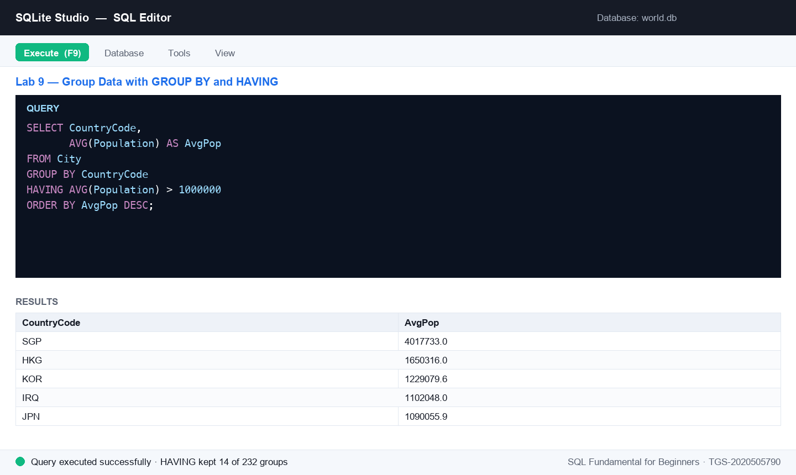

# SQL Fundamental for Beginners — Learner Guide

**WSQ Course Code:** TGS-2020505790  |  **Conducted by:** Tertiary Infotech Academy Pte Ltd (UEN 201200696W)  |  **Version v14 · 11 August 2026**

## Contents

- [Introduction](#introduction)
- [Course Learning Outcomes](#course-learning-outcomes)
- [How You Will Be Assessed](#how-you-will-be-assessed)
- [Before You Start — Environment Setup](#before-you-start--environment-setup)
- [The Course Data — SG Mart Pte Ltd](#the-course-data--sg-mart-pte-ltd)
- [Topic 01 — Data Modeling](#topic-01--data-modeling)
  - [Lab 1 — Set Up SQLite Studio & Import the SG Mart Database](#lab-1--set-up-sqlite-studio--import-the-sg-mart-database)
  - [Lab 2 — Create a Database and Tables](#lab-2--create-a-database-and-tables)
  - [Lab 3 — Model Data with Constraints and Keys](#lab-3--model-data-with-constraints-and-keys)
- [Topic 02 — Data Processing and Analysis](#topic-02--data-processing-and-analysis)
  - [Lab 4 — Query Data with SELECT](#lab-4--query-data-with-select)
  - [Lab 5 — Filter with SQL Operators](#lab-5--filter-with-sql-operators)
  - [Lab 6 — Insert, Update and Delete Records](#lab-6--insert-update-and-delete-records)
- [Topic 03 — Data Transformation](#topic-03--data-transformation)
  - [Lab 7 — Aggregate Data with COUNT, AVG and SUM](#lab-7--aggregate-data-with-count-avg-and-sum)
  - [Lab 8 — Join Data from Multiple Tables](#lab-8--join-data-from-multiple-tables)
  - [Lab 9 — Group Data with GROUP BY and HAVING](#lab-9--group-data-with-group-by-and-having)
- [Topic 04 — Introduction to Data Warehouse](#topic-04--introduction-to-data-warehouse)
  - [Lab 10 — Map an E-R Model to Database Tables (SMRT Case Study)](#lab-10--map-an-e-r-model-to-database-tables-smrt-case-study)
  - [Lab 11 — Author Stored Procedures for SQL Server](#lab-11--author-stored-procedures-for-sql-server)
- [SQL Quick Reference](#sql-quick-reference)
- [After the Course](#after-the-course)
- [Glossary](#glossary)


## Introduction

This Learner Guide accompanies the WSQ course SQL Fundamental for Beginners (TGS-2020505790), conducted by Tertiary Infotech Academy Pte Ltd. It provides detailed step-by-step instructions for all 11 hands-on labs, organised by the four course topics: Data Modeling, Data Processing and Analysis, Data Transformation, and Introduction to Data Warehouse. Every lab runs in SQLite Studio (or the free sqliteonline.com) against the SG Mart mock database supplied with the course.

Use this guide alongside the course slides and the lab files in the courseware/labs/ folder of the course repository. The slides present each concept and lab visually; THIS guide carries the full step-by-step SQL for you to type and run. The guide is an approved open-book reference during the final assessment.


## Course Learning Outcomes

- LO1: Apply data modeling for business processes.
- LO2: Apply data processing and analysis using SQL.
- LO3: Apply data transformation from multiple data sources.
- LO4: Apply data mapping to data warehouse.

Skills Framework: Data Engineering (ICT-DIT-3005-1.1), ICT Skills Framework.


## How You Will Be Assessed

The final assessment is conducted at the end of the training day and consists of two instruments:

- Practical Performance (PP) — hands-on SQL tasks, 70 minutes, open book, assessor-to-candidate ratio 1:10.
- Oral Questioning (OQ) — 20 minutes, one-to-one with the assessor.
- Format: Open Book — the course slides, this Learner Guide and other approved materials may be used.
- A minimum of 75% attendance is required and learners must be assessed as 'Competent' to be eligible for funding.
- You must take the Assessment digital attendance (TRAQOM) before the assessment begins, and sign the Assessment Summary Record after the Oral Questioning.
- An appeal process is available if required — speak to the trainer or the administrator.


## Before You Start — Environment Setup

**What you need**

- SQLite Studio — free, open-source, cross-platform. Download from https://sqlitestudio.pl and install for your OS.
- No-install alternative: the free cloud editor at https://sqliteonline.com (also offers an MS SQL engine for the stored-procedure lab).
- The course mock data — download the datasets folder from the course materials on https://lms-tms.tertiaryinfotech.com. It contains a prebuilt sgmart.db database, an Excel workbook and CSV files for every lab.
- Any laptop OS — Windows, macOS or Linux.


## The Course Data — SG Mart Pte Ltd

Every lab in this course works with one continuous business story so you are always querying something that means something. SG Mart Pte Ltd is a fictitious Singapore retail chain with eight outlets. You will model its shops, staff, members, suppliers and products, then analyse a full year of its sales. Topic 4 switches to an SMRT public-transport model for the data-warehouse case study.

> **Note:** All of this data is invented for training purposes. The names, phone numbers, email addresses and badge numbers do not identify any real person or organisation, and the SMRT figures are illustrative rather than operational records.

**The tables you will work with**

| Table | Rows | What it holds |
|---|---|---|
| Outlets | 8 | The 8 SG Mart retail outlets — code, name, planning area, postal sector, opening date and floor area. |
| Categories | 8 | 8 product categories grouped into Perishables, Packaged and Non-Food. |
| Suppliers | 9 | 9 suppliers with contact details, country of origin and lead time in days. |
| Customers | 60 | 60 loyalty members — tier, join date, points, birth year (some NULL) and home district. |
| Staff | 42 | 42 employees across the 8 outlets — role, salary, hire date and contact details (some emails are NULL on purpose). |
| Products | 25 | 25 SKUs with cost, retail price, category, supplier and reorder level (some NULL). |
| Orders | 180 | 180 sales orders across 2025 — outlet, member (NULL for walk-ins), cashier, channel, payment and status. |
| OrderItems | 685 | Order lines (the fact table) — quantity, unit price, discount and line total. Makes SUM/AVG/GROUP BY meaningful. |
| Routes | 8 | 8 SMRT routes (6 MRT lines + 2 bus services) — the parent entity of the transport E-R model. |
| Stations | 14 | 14 MRT stations with line position, interchange flag and opening date. |
| Timetables | 42 | 42 timetable rows — first/last trip and frequency per station for weekday, Saturday and Sunday/PH. |
| DisruptedRoutes | 6 | 6 service disruptions in 2025 — type, details, start time, duration and the alternative arrangements offered. |

**How the tables relate**

- Outlets 1—many Orders — every sale is rung up at one branch.
- Customers 1—many Orders — members link to their purchases; walk-in orders have a NULL CustomerID, which is what makes the LEFT JOIN lab meaningful.
- Staff 1—many Orders — the cashier who served the customer; each staff member belongs to one outlet.
- Orders 1—many OrderItems — the order header and its lines. OrderItems is the fact table: one row per product sold, carrying quantity, price, discount and line total.
- Categories 1—many Products and Suppliers 1—many Products — the two ways the range is classified.
- Routes 1—many Stations and 1—many Timetables; Timetables 1—many DisruptedRoutes — the SMRT chain used in Lab 10.

**Where to find it**

- Each lab has its own folder under courseware/labs/ holding the instructions, the tables that lab needs as CSV, and the seed scripts — all together.
- seed_sqlite.sql creates and fills every table for that lab in one execution — this is the fastest way to start.
- seed_mysql.sql is the same data in MySQL / SQL Server syntax, used for the stored-procedure lab.
- courseware/labs/_all/ holds the complete set: SG-Mart-Mock-Data.xlsx (one sheet per table), the prebuilt sgmart.db, and every CSV.

**A note on empty values**

Some columns are deliberately left empty: a few staff have no work email, some members declined to give a birth year, two products have no reorder level, and seventeen orders were walk-in sales with no membership attached. These gaps are intentional. They are what let you practise IS NULL, see how COUNT() skips NULLs, and understand why a LEFT JOIN returns rows an INNER JOIN would silently drop.

**Set up SQLite Studio**

Install SQLite Studio, then connect a database: Database → Add a database, browse to a .db file (or click the green '+' to create a new one) and Connect to the database from the left-hand Databases panel. Open the query editor with Tools → Open SQL editor and check the active database shown at the top of the editor.

**Conventions used in every lab**

- SQL statements are shown in code blocks — type or paste them into the SQL editor and press the Execute (▶ / F9) button.
- SQL keywords are shown in UPPERCASE by convention; SQLite accepts any case.
- Statements end with a semicolon; you can run several statements together.
- Labs 1–10 use SQLite; Lab 11 (stored procedures) uses SQL Server syntax — author it on sqliteonline.com's MS SQL engine.
- If a query fails, read the error message at the bottom of the editor — it names the offending token.


## Topic 01 — Data Modeling

Data Sources · Data Modeling · SQL Data Types · Create & Manage Databases  (TSC mapping: A1, A2, K1, K2)

**Key concepts**

- Relational databases — A database is one or more tables; each table is rows (records) and columns (fields) with a fixed row type.
- DDL statements — CREATE / ALTER / DROP define databases, tables, indexes and their columns and data types.
- Constraints — NOT NULL, DEFAULT, UNIQUE, CHECK, PRIMARY KEY and FOREIGN KEY enforce rules on the data.
- Data modeling — Primary and foreign keys link tables into entity relationships that mirror the business process.


### Lab 1 — Set Up SQLite Studio & Import the SG Mart Database

Objective: LO1 — identify relevant data sources and set up the SQL workbench (A1, A2).

Goal: Install SQLite Studio, connect it to the SG Mart sample database and explore its tables — your data source for the whole course.

**What you'll build**

A working SQLite Studio with the SG Mart database connected, showing the Outlets, Products and Categories tables.   (Tools: SQLite Studio, sgmart.db mock database, LMS course materials.)

**Mock data for this lab**

Load the data before you start. The tables below are supplied as CSV in courseware/labs/lab-01-*/ — the same folder as this lab's instructions — together with seed_sqlite.sql. Open that script in the SQL editor and execute it to create and fill every table in one step.

| Table | Rows | What it holds |
|---|---|---|
| Outlets | 8 | The 8 SG Mart retail outlets — code, name, planning area, postal sector, opening date and floor area. |
| Products | 25 | 25 SKUs with cost, retail price, category, supplier and reorder level (some NULL). |
| Categories | 8 | 8 product categories grouped into Perishables, Packaged and Non-Food. |


*Figure 1 — Lab 1: the SQL editor after running this lab's key statement.*

**Step-by-step**

1. Download SQLite Studio for your OS from the official site and install it. (Alternative: use the free cloud version at sqliteonline.com — no install needed.)

   ```sql
   https://sqlitestudio.pl
   ```

2. Download the course mock data from the LMS. You want the datasets folder — it contains sgmart.db (a ready-built SQLite database), an Excel workbook and the CSV files.

   ```sql
   https://lms-tms.tertiaryinfotech.com
   ```

3. Open SQLite Studio, click Database → Add a database, browse to the downloaded sgmart.db and click OK.
4. In the left-hand Databases panel, right-click sgmart and choose Connect to the database.
5. Expand the database tree. You should see the SG Mart tables — Outlets, Categories, Suppliers, Products, Customers, Staff, Orders and OrderItems. Double-click Outlets and open the Data tab to preview its 8 rows.
6. Run your first query to confirm the connection works — list the retail outlets by floor area, largest first.

   ```sql
   SELECT OutletCode, OutletName, District, FloorAreaSqm
   FROM Outlets
   ORDER BY FloorAreaSqm DESC;
   ```

7. Open Outlets.csv from the datasets folder in Excel to see the same data as a spreadsheet. This is the raw form the business hands you before it becomes a table.

**Test it**

The Databases panel shows the connected sgmart database with the Outlets, Products, Customers, Orders and OrderItems tables; the Data tab displays outlet rows; and the ORDER BY query returns 8 outlets led by SG Mart Tampines Hub (1680.5 sqm).

> **Note:** The same steps are in courseware/labs/lab-01-*/ in the course repository, alongside that lab's CSV data and SQL seed scripts.

---


### Lab 2 — Create a Database and Tables

Objective: LO1 — create and manage databases and tables with SQL DDL (A1, A2).

Goal: Create your own database named 'sgmart_practice' and build the Outlets, Categories, Suppliers and Products tables with CREATE TABLE, choosing an appropriate data type for every column.

**What you'll build**

A new 'sgmart_practice' database containing four tables whose columns, data types and defaults model the SG Mart retail business.   (Tools: SQLite Studio, SQL Editor, lab-02 dataset (CSV + seed script).)

**Mock data for this lab**

Load the data before you start. The tables below are supplied as CSV in courseware/labs/lab-02-*/ — the same folder as this lab's instructions — together with seed_sqlite.sql. Open that script in the SQL editor and execute it to create and fill every table in one step.

| Table | Rows | What it holds |
|---|---|---|
| Outlets | 8 | The 8 SG Mart retail outlets — code, name, planning area, postal sector, opening date and floor area. |
| Categories | 8 | 8 product categories grouped into Perishables, Packaged and Non-Food. |
| Suppliers | 9 | 9 suppliers with contact details, country of origin and lead time in days. |
| Products | 25 | 25 SKUs with cost, retail price, category, supplier and reorder level (some NULL). |



*Figure 2 — Lab 2: the SQL editor after running this lab's key statement.*

**Step-by-step**

1. In SQLite Studio click Database → Add a database, then click the green '+' (plus) icon, name the new database file sgmart_practice and save it. Connect to it from the Databases panel.
2. Open the SQL editor: go to Tools → Open SQL editor. Make sure the active database (top of the editor) is sgmart_practice.
3. Create the Outlets table — the retail branches. Note the TEXT primary key and the REAL column for floor area.

   ```sql
   DROP TABLE IF EXISTS Outlets;
   CREATE TABLE Outlets (
     OutletCode   TEXT PRIMARY KEY,
     OutletName   TEXT NOT NULL DEFAULT '',
     District     TEXT NOT NULL DEFAULT '',
     PostalSector TEXT NOT NULL DEFAULT '',
     OpenedDate   TEXT,
     FloorAreaSqm REAL DEFAULT 0.0
   );
   ```

4. Create the Categories table — how SG Mart groups what it sells.

   ```sql
   DROP TABLE IF EXISTS Categories;
   CREATE TABLE Categories (
     CategoryCode  TEXT PRIMARY KEY,
     CategoryName  TEXT NOT NULL DEFAULT '',
     CategoryGroup TEXT NOT NULL DEFAULT 'Packaged'
   );
   ```

5. Create the Suppliers table, including a lead time in days used later for reorder planning.

   ```sql
   DROP TABLE IF EXISTS Suppliers;
   CREATE TABLE Suppliers (
     SupplierID   TEXT PRIMARY KEY,
     SupplierName TEXT NOT NULL DEFAULT '',
     Address      TEXT,
     Phone        TEXT,
     Country      TEXT NOT NULL DEFAULT 'Singapore',
     LeadTimeDays INTEGER DEFAULT 14
   );
   ```

6. Create the Products table — the item master. Cost and price are REAL, IsActive is a 0/1 flag.

   ```sql
   DROP TABLE IF EXISTS Products;
   CREATE TABLE Products (
     SKU           TEXT PRIMARY KEY,
     ProductName   TEXT NOT NULL DEFAULT '',
     CategoryCode  TEXT NOT NULL DEFAULT '',
     UnitOfMeasure TEXT NOT NULL DEFAULT 'each',
     UnitCost      REAL DEFAULT NULL,
     UnitPrice     REAL DEFAULT NULL,
     SupplierID    TEXT,
     ReorderLevel  INTEGER DEFAULT NULL,
     IsActive      INTEGER NOT NULL DEFAULT 1
   );
   ```

7. Load the mock data: open seed_sqlite.sql from this lab's dataset folder and execute the whole script. It fills all four tables. (Or use Tools → Import to load each CSV instead.)
8. Right-click the sgmart_practice database and choose Refresh — the four tables appear. Open each table's Structure tab to verify the columns and data types, then check the row counts.

   ```sql
   SELECT COUNT(*) AS Outlets FROM Outlets;
   SELECT COUNT(*) AS Categories FROM Categories;
   SELECT COUNT(*) AS Suppliers FROM Suppliers;
   SELECT COUNT(*) AS Products FROM Products;
   ```


**Test it**

The sgmart_practice database lists Outlets, Categories, Suppliers and Products; each Structure tab shows the declared columns, data types, defaults and primary keys; and the counts return 8, 8, 9 and 25 rows.

> **Note:** The same steps are in courseware/labs/lab-02-*/ in the course repository, alongside that lab's CSV data and SQL seed scripts.

---


### Lab 3 — Model Data with Constraints and Keys

Objective: LO1 — apply data modeling for business processes with constraints, keys and relationships (A1, A2).

Goal: Build a Persons–PersonOrders mini-model: enforce data rules with NOT NULL, UNIQUE, DEFAULT and CHECK, link the tables with a PRIMARY KEY / FOREIGN KEY relationship, and speed up searches with an index.

**What you'll build**

A two-table data model (Persons ← PersonOrders) with working constraints, a foreign-key relationship and an index.   (Tools: SQLite Studio, SQL Editor, lab-03 dataset (Persons + PersonOrders).)

**Mock data for this lab**

Load the data before you start. The tables below are supplied as CSV in courseware/labs/lab-03-*/ — the same folder as this lab's instructions — together with seed_sqlite.sql. Open that script in the SQL editor and execute it to create and fill every table in one step.

| Table | Rows | What it holds |
|---|---|---|
| Persons | 8 | Small Persons table for constraint practice (NOT NULL, UNIQUE, CHECK Age >= 18, DEFAULT City). |
| PersonOrders | 8 | Child table for the Persons FK demo — some rows point at persons who exist, one is deliberately unmatched. |



*Figure 3 — Lab 3: the SQL editor after running this lab's key statement.*

**Step-by-step**

1. In the sgmart_practice database's SQL editor, create a Persons table that enforces NOT NULL, UNIQUE, DEFAULT and CHECK rules. SG Mart only issues accounts to adults, so Age must be 18 or over.

   ```sql
   DROP TABLE IF EXISTS Persons;
   CREATE TABLE Persons (
     ID        INTEGER NOT NULL UNIQUE,
     LastName  TEXT NOT NULL,
     FirstName TEXT,
     Age       INTEGER CHECK (Age >= 18),
     City      TEXT DEFAULT 'Singapore',
     Email     TEXT,
     PRIMARY KEY (ID)
   );
   ```

2. Prove the constraints work: this insert succeeds and fills City with the default value.

   ```sql
   INSERT INTO Persons (ID, LastName, FirstName, Age)
   VALUES (1, 'Tan', 'Alice', 30);
   SELECT * FROM Persons;
   ```

3. Now try to break the rules — each of these statements must FAIL (duplicate ID, NULL LastName, under-age CHECK). Run them one at a time and read the error message.

   ```sql
   INSERT INTO Persons (ID, LastName, Age) VALUES (1, 'Lim', 25);
   INSERT INTO Persons (ID, Age) VALUES (2, 40);
   INSERT INTO Persons (ID, LastName, Age) VALUES (3, 'Lee', 15);
   ```

4. Load the rest of the mock people from this lab's dataset — run seed_sqlite.sql, or paste these rows. Note Divya Kumar and Priya Nair have no email on file (NULL).

   ```sql
   INSERT INTO Persons (ID, LastName, FirstName, Age, City, Email) VALUES
     (2, 'Lim', 'Bryan', 42, 'Singapore', 'bryan.lim@example.com'),
     (3, 'Kumar', 'Divya', 27, 'Singapore', NULL),
     (4, 'Wong', 'Cheryl', 35, 'Johor Bahru', 'cheryl.wong@example.com'),
     (5, 'Ibrahim', 'Hafiz', 24, 'Singapore', 'hafiz.ibrahim@example.com'),
     (6, 'Lee', 'Marcus', 51, 'Singapore', 'marcus.lee@example.com'),
     (7, 'Nair', 'Priya', 38, 'Singapore', NULL),
     (8, 'Goh', 'Wei Ming', 19, 'Singapore', 'weiming.goh@example.com');
   ```

5. Create the PersonOrders table whose PersonID column is a FOREIGN KEY referencing Persons — the child table pointing at the parent.

   ```sql
   DROP TABLE IF EXISTS PersonOrders;
   CREATE TABLE PersonOrders (
     OrderID     INTEGER NOT NULL,
     OrderNumber INTEGER NOT NULL,
     PersonID    INTEGER,
     OrderDate   TEXT,
     Amount      REAL,
     PRIMARY KEY (OrderID),
     FOREIGN KEY (PersonID) REFERENCES Persons(ID)
   );
   ```

6. Load the order rows. The last one has a NULL PersonID — an order taken before the customer registered.

   ```sql
   INSERT INTO PersonOrders VALUES
     (1, 77895, 3, '2025-02-11', 128.40),
     (2, 44678, 3, '2025-03-04',  56.90),
     (3, 22456, 1, '2025-03-22', 312.75),
     (4, 24562, 1, '2025-05-08',  89.20),
     (5, 34764, 6, '2025-06-15', 204.60),
     (6, 51230, 2, '2025-07-30',  47.85),
     (7, 66120, 7, '2025-08-19', 156.30),
     (8, 71984, NULL, '2025-09-02', 63.10);
   ```

7. Check the relationship holds — list each order beside the person who placed it.

   ```sql
   SELECT o.OrderNumber, p.FirstName, p.LastName, o.Amount
   FROM PersonOrders o
   INNER JOIN Persons p ON o.PersonID = p.ID
   ORDER BY o.Amount DESC;
   ```

8. Add a column to an existing table with ALTER TABLE.

   ```sql
   ALTER TABLE Persons ADD MemberTier TEXT DEFAULT 'Basic';
   ```

9. Create an index so searches on LastName are fast.

   ```sql
   CREATE INDEX idx_lastname ON Persons (LastName);
   ```


**Test it**

The valid insert appears in Persons with City = 'Singapore'; the three rule-breaking inserts each raise a constraint error; the join returns 7 matched orders led by 312.75; PersonOrders shows a foreign key to Persons in its DDL; and idx_lastname is listed under Indexes.

> **Note:** The same steps are in courseware/labs/lab-03-*/ in the course repository, alongside that lab's CSV data and SQL seed scripts.

---


## Topic 02 — Data Processing and Analysis

SQL Queries · SQL Operators · Insert, Update & Delete  (TSC mapping: A3, A5, K4)

**Key concepts**

- Queries — SELECT retrieves data into a result-set; DISTINCT removes duplicates; WHERE filters rows.
- Operators — AND/OR/NOT, IN, BETWEEN, LIKE wildcards and IS NULL build precise filter conditions.
- Shaping results — ORDER BY sorts, LIMIT caps the row count, and aliases (AS) rename columns and tables.
- Changing data — INSERT INTO adds records, UPDATE modifies them and DELETE removes them — always with WHERE.


### Lab 4 — Query Data with SELECT

Objective: LO2 — apply data processing and analysis using SQL queries (A3, A5).

Goal: Query the SG Mart product catalogue with SELECT: retrieve all columns, chosen columns, distinct values and filtered rows, then combine sorting and limits to answer real merchandising questions.

**What you'll build**

A set of working queries answering questions about SG Mart's products, categories and outlets.   (Tools: SQLite Studio, sgmart database, lab-04 dataset.)

**Mock data for this lab**

Load the data before you start. The tables below are supplied as CSV in courseware/labs/lab-04-*/ — the same folder as this lab's instructions — together with seed_sqlite.sql. Open that script in the SQL editor and execute it to create and fill every table in one step.

| Table | Rows | What it holds |
|---|---|---|
| Products | 25 | 25 SKUs with cost, retail price, category, supplier and reorder level (some NULL). |
| Categories | 8 | 8 product categories grouped into Perishables, Packaged and Non-Food. |
| Outlets | 8 | The 8 SG Mart retail outlets — code, name, planning area, postal sector, opening date and floor area. |


*Figure 4 — Lab 4: the SQL editor after running this lab's key statement.*

**Step-by-step**

1. In the sgmart database's SQL editor, retrieve every row and column of Products, then only the columns a price list needs.

   ```sql
   SELECT * FROM Products;
   SELECT ProductName, UnitPrice FROM Products;
   ```

2. List each category code just once with SELECT DISTINCT — how many distinct categories does the range span?

   ```sql
   SELECT DISTINCT CategoryCode FROM Products;
   ```

3. Filter rows with WHERE — every product supplied by Lion City Beverages (SUP05).

   ```sql
   SELECT SKU, ProductName, UnitPrice
   FROM Products
   WHERE SupplierID = 'SUP05';
   ```

4. Answer: what are the 10 most expensive products, dearest first?

   ```sql
   SELECT ProductName, UnitPrice
   FROM Products
   ORDER BY UnitPrice DESC
   LIMIT 10;
   ```

5. Answer: which 5 outlets have the largest floor area, and in which district?

   ```sql
   SELECT OutletName, District, FloorAreaSqm
   FROM Outlets
   ORDER BY FloorAreaSqm DESC
   LIMIT 5;
   ```

6. Combine a filter with a sort — active products under $5, cheapest first. This is the query a promotions planner actually runs.

   ```sql
   SELECT ProductName, UnitPrice, CategoryCode
   FROM Products
   WHERE IsActive = 1
     AND UnitPrice < 5.00
   ORDER BY UnitPrice;
   ```


**Test it**

Each query runs without error; the DISTINCT query returns 8 category codes; the top-10 price query is led by Pineapple Tarts 300g at $11.90; and the largest outlet is SG Mart Tampines Hub (1680.5 sqm).

> **Note:** The same steps are in courseware/labs/lab-04-*/ in the course repository, alongside that lab's CSV data and SQL seed scripts.

---


### Lab 5 — Filter with SQL Operators

Objective: LO2 — analyse data with operators, patterns and sorting (A3, A5).

Goal: Sharpen your WHERE clauses with AND/OR/NOT, IN, BETWEEN, LIKE wildcards, NULL tests and aliases to slice the SG Mart customer and staff data precisely.

**What you'll build**

A query toolkit covering every SQL operator, answering pattern- and range-based questions on the SG Mart data.   (Tools: SQLite Studio, sgmart database, lab-05 dataset.)

**Mock data for this lab**

Load the data before you start. The tables below are supplied as CSV in courseware/labs/lab-05-*/ — the same folder as this lab's instructions — together with seed_sqlite.sql. Open that script in the SQL editor and execute it to create and fill every table in one step.

| Table | Rows | What it holds |
|---|---|---|
| Customers | 60 | 60 loyalty members — tier, join date, points, birth year (some NULL) and home district. |
| Products | 25 | 25 SKUs with cost, retail price, category, supplier and reorder level (some NULL). |
| Staff | 42 | 42 employees across the 8 outlets — role, salary, hire date and contact details (some emails are NULL on purpose). |



*Figure 5 — Lab 5: the SQL editor after running this lab's key statement.*

**Step-by-step**

1. Combine conditions with AND — Store Managers earning more than $6,000 a month.

   ```sql
   SELECT FirstName, LastName, Role, MonthlySalary
   FROM Staff
   WHERE Role = 'Store Manager'
     AND MonthlySalary > 6000;
   ```

2. Use OR and NOT — everyone who is NOT a Cashier but works part-time.

   ```sql
   SELECT FirstName, LastName, Role, Employment
   FROM Staff
   WHERE NOT Role = 'Cashier'
     AND Employment = 'Part-Time';
   ```

3. Match a list of values with IN — members on the two premium tiers.

   ```sql
   SELECT FirstName, LastName, MemberTier, PointsBalance
   FROM Customers
   WHERE MemberTier IN ('Gold', 'Platinum')
   ORDER BY PointsBalance DESC;
   ```

4. Select a range with BETWEEN — everyday products priced between $3 and $6.

   ```sql
   SELECT ProductName, UnitPrice
   FROM Products
   WHERE UnitPrice BETWEEN 3.00 AND 6.00
   ORDER BY UnitPrice;
   ```

5. Find patterns with LIKE — every frozen line (the % wildcard matches any characters).

   ```sql
   SELECT ProductName, UnitPrice
   FROM Products
   WHERE ProductName LIKE 'Frozen%'
   ORDER BY ProductName;
   ```

6. LIKE also matches mid-string — anything sold in a bottle, whatever the size.

   ```sql
   SELECT ProductName, UnitOfMeasure
   FROM Products
   WHERE UnitOfMeasure LIKE '%bottle%';
   ```

7. Test for missing values with IS NULL — staff with no work email on file — and rename a column with an alias.

   ```sql
   SELECT FirstName || ' ' || LastName AS StaffName,
          Role AS JobTitle,
          Email
   FROM Staff
   WHERE Email IS NULL;
   ```

8. The opposite test — members who DID give a birth year, so marketing can run a birthday campaign.

   ```sql
   SELECT FirstName, LastName, BirthYear
   FROM Customers
   WHERE BirthYear IS NOT NULL
   ORDER BY BirthYear
   LIMIT 10;
   ```


**Test it**

The IN query returns 16 Gold and Platinum members ordered by points; BETWEEN returns 11 products from $3.20 to $5.95; LIKE 'Frozen%' returns the 2 frozen lines; and IS NULL returns the 5 staff with no email, shown under the alias StaffName.

> **Note:** The same steps are in courseware/labs/lab-05-*/ in the course repository, alongside that lab's CSV data and SQL seed scripts.

---


### Lab 6 — Insert, Update and Delete Records

Objective: LO2 — process data by inserting, updating and deleting records (A3, A5).

Goal: Change data safely: INSERT a new product line, UPDATE prices with a WHERE clause, DELETE a discontinued record, and reload the dataset from the provided seed script.

**What you'll build**

A modified Products table proving you can add, change and remove records — plus a cleanly reloaded database.   (Tools: SQLite Studio, sgmart database, lab-06 seed script.)

**Mock data for this lab**

Load the data before you start. The tables below are supplied as CSV in courseware/labs/lab-06-*/ — the same folder as this lab's instructions — together with seed_sqlite.sql. Open that script in the SQL editor and execute it to create and fill every table in one step.

| Table | Rows | What it holds |
|---|---|---|
| Products | 25 | 25 SKUs with cost, retail price, category, supplier and reorder level (some NULL). |
| Customers | 60 | 60 loyalty members — tier, join date, points, birth year (some NULL) and home district. |
| Orders | 180 | 180 sales orders across 2025 — outlet, member (NULL for walk-ins), cashier, channel, payment and status. |



*Figure 6 — Lab 6: the SQL editor after running this lab's key statement.*

**Step-by-step**

1. SG Mart is adding a new bakery line. Insert it, supplying just the columns you know — the rest take their defaults.

   ```sql
   INSERT INTO Products (SKU, ProductName, CategoryCode, UnitOfMeasure, UnitCost, UnitPrice, SupplierID)
   VALUES ('SKU1026', 'Pandan Chiffon Cake 450g', 'CAT03', 'each', 4.50, 8.20, 'SUP04');
   ```

2. Verify the insert — find your new row.

   ```sql
   SELECT * FROM Products WHERE SKU = 'SKU1026';
   ```

3. Insert several rows in one statement — three new members joining at the Punggol launch.

   ```sql
   INSERT INTO Customers (CustomerID, FirstName, LastName, MemberTier, JoinDate, PointsBalance, BirthYear, District, Phone, Email)
   VALUES
     (1061, 'Wei Jie', 'Tan',  'Basic',  '2025-11-02', 0,    1996, 'Punggol', '9123 4567', 'weijie.tan@example.com'),
     (1062, 'Nur Syahirah', 'Osman', 'Basic', '2025-11-02', 50, 1990, 'Punggol', '8234 5678', NULL),
     (1063, 'Divya', 'Menon', 'Silver', '2025-11-03', 1200, 1988, 'Sengkang', '9345 6789', 'divya.menon@example.com');
   ```

4. Update records with a WHERE clause — a 10% price rise on every Beverages line. Always SELECT first to see what you are about to change.

   ```sql
   SELECT ProductName, UnitPrice FROM Products WHERE CategoryCode = 'CAT04';
   
   UPDATE Products
   SET UnitPrice = ROUND(UnitPrice * 1.10, 2)
   WHERE CategoryCode = 'CAT04';
   
   SELECT ProductName, UnitPrice FROM Products WHERE CategoryCode = 'CAT04';
   ```

5. Update more than one column at once — promote a member and credit bonus points.

   ```sql
   UPDATE Customers
   SET MemberTier = 'Gold',
       PointsBalance = PointsBalance + 500
   WHERE CustomerID = 1063;
   ```

6. Delete one specific record by its primary key. (Never run DELETE without WHERE — it removes every row.)

   ```sql
   DELETE FROM Products WHERE SKU = 'SKU1026';
   ```

7. Delete a set of rows with a condition — clear out the cancelled orders.

   ```sql
   SELECT COUNT(*) FROM Orders WHERE Status = 'Cancelled';
   DELETE FROM Orders WHERE Status = 'Cancelled';
   ```

8. Restore the database to its original state: open seed_sqlite.sql from this lab's dataset folder and execute it. The script drops and recreates every table, so your practice changes are undone.
9. Confirm the reload with row counts.

   ```sql
   SELECT COUNT(*) AS Products FROM Products;
   SELECT COUNT(*) AS Customers FROM Customers;
   SELECT COUNT(*) AS Orders FROM Orders;
   ```


**Test it**

The SKU1026 row appears after the INSERT and is gone after the DELETE; the three new members are added; Beverages prices rise by 10% (Sparkling Water 1.5L goes from 2.35 to 2.59); and after reloading, the counts return 25 products, 60 customers and 180 orders.

> **Note:** The same steps are in courseware/labs/lab-06-*/ in the course repository, alongside that lab's CSV data and SQL seed scripts.

---


## Topic 03 — Data Transformation

Aggregate Data · Join Data · Group Data  (TSC mapping: A4, A6, K5, K6)

**Key concepts**

- Aggregate functions — COUNT, AVG and SUM collapse many rows into one summary value.
- Joins — INNER, LEFT, RIGHT and FULL OUTER joins combine rows from two tables on a matching key.
- Set operations — UNION stacks the result-sets of two SELECTs with matching columns.
- Grouping — GROUP BY aggregates per group; HAVING filters groups the way WHERE filters rows.


### Lab 7 — Aggregate Data with COUNT, AVG and SUM

Objective: LO3 — transform data with aggregate functions (A4, A6).

Goal: Summarise SG Mart's sales with COUNT, AVG, SUM, MIN and MAX: count transactions, average basket values, total revenue, and combine aggregates with DISTINCT and WHERE to answer real management questions.

**What you'll build**

A management summary of SG Mart trading — order counts, average and total revenue, and filtered aggregate answers.   (Tools: SQLite Studio, sgmart database, lab-07 dataset.)

**Mock data for this lab**

Load the data before you start. The tables below are supplied as CSV in courseware/labs/lab-07-*/ — the same folder as this lab's instructions — together with seed_sqlite.sql. Open that script in the SQL editor and execute it to create and fill every table in one step.

| Table | Rows | What it holds |
|---|---|---|
| Orders | 180 | 180 sales orders across 2025 — outlet, member (NULL for walk-ins), cashier, channel, payment and status. |
| OrderItems | 685 | Order lines (the fact table) — quantity, unit price, discount and line total. Makes SUM/AVG/GROUP BY meaningful. |
| Products | 25 | 25 SKUs with cost, retail price, category, supplier and reorder level (some NULL). |


*Figure 7 — Lab 7: the SQL editor after running this lab's key statement.*

**Step-by-step**

1. Count the rows in Orders — how many transactions did SG Mart record in 2025?

   ```sql
   SELECT COUNT(*) AS TotalOrders FROM Orders;
   ```

2. COUNT ignores NULLs, and that is useful. Compare these two — the difference is the walk-in customers with no membership.

   ```sql
   SELECT COUNT(*)          AS AllOrders,
          COUNT(CustomerID) AS MemberOrders
   FROM Orders;
   ```

3. Average a numeric column — the mean value of a sales line.

   ```sql
   SELECT ROUND(AVG(LineTotal), 2) AS AvgLineValue
   FROM OrderItems;
   ```

4. Total a numeric column — SG Mart's full-year revenue.

   ```sql
   SELECT ROUND(SUM(LineTotal), 2) AS TotalRevenue
   FROM OrderItems;
   ```

5. MIN and MAX bracket the range — the cheapest and dearest thing on the shelf.

   ```sql
   SELECT MIN(UnitPrice) AS Cheapest,
          MAX(UnitPrice) AS Dearest
   FROM Products;
   ```

6. Answer: how many distinct payment methods do customers actually use?

   ```sql
   SELECT COUNT(DISTINCT PaymentMethod) AS PaymentMethods
   FROM Orders;
   ```

7. Answer: how many orders were completed, as opposed to refunded or cancelled?

   ```sql
   SELECT COUNT(*) AS CompletedOrders
   FROM Orders
   WHERE Status = 'Completed';
   ```

8. Put it together — the average basket for online orders only, rounded to cents.

   ```sql
   SELECT ROUND(AVG(oi.LineTotal), 2) AS AvgOnlineLine,
          COUNT(*)                    AS OnlineLines
   FROM Orders o
   INNER JOIN OrderItems oi ON o.OrderID = oi.OrderID
   WHERE o.Channel = 'Online';
   ```


**Test it**

COUNT(*) returns 180 orders while COUNT(CustomerID) returns 163 (17 walk-ins are NULL); average line value is 13.48; total revenue is 9231.43; prices range from 2.10 to 11.90; and there are 5 distinct payment methods with 165 completed orders.

> **Note:** The same steps are in courseware/labs/lab-07-*/ in the course repository, alongside that lab's CSV data and SQL seed scripts.

---


### Lab 8 — Join Data from Multiple Tables

Objective: LO3 — transform data from multiple sources with joins and unions (A4, A6).

Goal: Combine tables: INNER JOIN orders to outlets and products, see how LEFT JOIN keeps the walk-in orders that have no member, chain three joins together, and emulate a FULL OUTER JOIN in SQLite using LEFT JOIN + UNION.

**What you'll build**

Joined result-sets linking orders, outlets, customers and products, plus a full-outer-join of two practice tables showing matched and unmatched rows.   (Tools: SQLite Studio, sgmart database, lab-08 dataset.)

**Mock data for this lab**

Load the data before you start. The tables below are supplied as CSV in courseware/labs/lab-08-*/ — the same folder as this lab's instructions — together with seed_sqlite.sql. Open that script in the SQL editor and execute it to create and fill every table in one step.

| Table | Rows | What it holds |
|---|---|---|
| Orders | 180 | 180 sales orders across 2025 — outlet, member (NULL for walk-ins), cashier, channel, payment and status. |
| OrderItems | 685 | Order lines (the fact table) — quantity, unit price, discount and line total. Makes SUM/AVG/GROUP BY meaningful. |
| Customers | 60 | 60 loyalty members — tier, join date, points, birth year (some NULL) and home district. |
| Outlets | 8 | The 8 SG Mart retail outlets — code, name, planning area, postal sector, opening date and floor area. |
| Products | 25 | 25 SKUs with cost, retail price, category, supplier and reorder level (some NULL). |
| left_t | 4 | Practice table for the FULL OUTER JOIN emulation (ids 1-4). |
| right_t | 4 | Practice table for the FULL OUTER JOIN emulation (ids 3-6). |



*Figure 8 — Lab 8: the SQL editor after running this lab's key statement.*

**Step-by-step**

1. Inner join Orders and Outlets on the outlet code — each order with the branch that took it.

   ```sql
   SELECT o.OrderID, o.OrderDate, ot.OutletName, ot.District
   FROM Orders o
   INNER JOIN Outlets ot
     ON o.OutletCode = ot.OutletCode
   LIMIT 20;
   ```

2. Join the fact table to the item master — what was actually sold, line by line.

   ```sql
   SELECT oi.OrderID,
          p.ProductName,
          oi.Quantity,
          oi.LineTotal
   FROM OrderItems oi
   INNER JOIN Products p
     ON oi.SKU = p.SKU
   ORDER BY oi.LineTotal DESC
   LIMIT 15;
   ```

3. LEFT JOIN keeps every row of the left table even without a match — every order, with the member's name where there is one. Walk-ins show NULL.

   ```sql
   SELECT o.OrderID, o.OrderDate,
          c.FirstName, c.LastName
   FROM Orders o
   LEFT JOIN Customers c
     ON o.CustomerID = c.CustomerID
   ORDER BY o.OrderID
   LIMIT 25;
   ```

4. Isolate the unmatched rows — this is the standard 'find the orphans' pattern.

   ```sql
   SELECT COUNT(*) AS WalkInOrders
   FROM Orders o
   LEFT JOIN Customers c
     ON o.CustomerID = c.CustomerID
   WHERE c.CustomerID IS NULL;
   ```

5. Chain three joins to answer a real question: which outlet sold which product, and for how much?

   ```sql
   SELECT ot.OutletName,
          p.ProductName,
          ROUND(SUM(oi.LineTotal), 2) AS Revenue
   FROM Orders o
   INNER JOIN Outlets    ot ON o.OutletCode = ot.OutletCode
   INNER JOIN OrderItems oi ON o.OrderID    = oi.OrderID
   INNER JOIN Products   p  ON oi.SKU       = p.SKU
   GROUP BY ot.OutletName, p.ProductName
   ORDER BY Revenue DESC
   LIMIT 10;
   ```

6. Create two small practice tables to demonstrate a full outer join.

   ```sql
   DROP TABLE IF EXISTS left_t;
   DROP TABLE IF EXISTS right_t;
   CREATE TABLE left_t  ( id INTEGER, description TEXT );
   CREATE TABLE right_t ( id INTEGER, description TEXT );
   INSERT INTO left_t  VALUES (1,'left 01'),(2,'left 02'),(3,'left 03'),(4,'left 04');
   INSERT INTO right_t VALUES (3,'right 03'),(4,'right 04'),(5,'right 05'),(6,'right 06');
   ```

7. Older SQLite builds have no FULL OUTER JOIN keyword — emulate it with a LEFT JOIN in each direction combined by UNION. Alias every output column: after a UNION, ORDER BY can only refer to the result-set column names, so 'ORDER BY id' fails unless you name the column id.

   ```sql
   SELECT l.id AS id,
          l.description AS left_desc,
          r.description AS right_desc
   FROM left_t l LEFT JOIN right_t r ON l.id = r.id
   UNION
   SELECT r.id AS id,
          l.description AS left_desc,
          r.description AS right_desc
   FROM right_t r LEFT JOIN left_t l ON l.id = r.id
   ORDER BY id;
   ```


**Test it**

The inner joins return only matched rows; the LEFT JOIN lists every order with NULL names for walk-ins and the orphan count returns 17; the three-way join is led by SG Mart outlets selling Pineapple Tarts; and the full-join emulation returns ids 1–6 with NULLs on the sides that have no match.

> **Note:** The same steps are in courseware/labs/lab-08-*/ in the course repository, alongside that lab's CSV data and SQL seed scripts.

---


### Lab 9 — Group Data with GROUP BY and HAVING

Objective: LO3 — transform data by grouping and filtering groups (A4, A6).

Goal: Aggregate per group: revenue by outlet and by category with GROUP BY, then keep only the groups that matter with HAVING — and see why HAVING exists where WHERE cannot go.

**What you'll build**

Grouped sales summaries of the SG Mart data — per-outlet and per-category totals, filtered to the groups that matter.   (Tools: SQLite Studio, sgmart database, lab-09 dataset.)

**Mock data for this lab**

Load the data before you start. The tables below are supplied as CSV in courseware/labs/lab-09-*/ — the same folder as this lab's instructions — together with seed_sqlite.sql. Open that script in the SQL editor and execute it to create and fill every table in one step.

| Table | Rows | What it holds |
|---|---|---|
| Orders | 180 | 180 sales orders across 2025 — outlet, member (NULL for walk-ins), cashier, channel, payment and status. |
| OrderItems | 685 | Order lines (the fact table) — quantity, unit price, discount and line total. Makes SUM/AVG/GROUP BY meaningful. |
| Products | 25 | 25 SKUs with cost, retail price, category, supplier and reorder level (some NULL). |
| Categories | 8 | 8 product categories grouped into Perishables, Packaged and Non-Food. |
| Outlets | 8 | The 8 SG Mart retail outlets — code, name, planning area, postal sector, opening date and floor area. |



*Figure 9 — Lab 9: the SQL editor after running this lab's key statement.*

**Step-by-step**

1. Count the orders taken by each outlet — one row per group.

   ```sql
   SELECT OutletCode, COUNT(*) AS Orders
   FROM Orders
   GROUP BY OutletCode
   ORDER BY Orders DESC;
   ```

2. Group across a join — total revenue per outlet, with a readable name and alias.

   ```sql
   SELECT ot.OutletName,
          ROUND(SUM(oi.LineTotal), 2) AS Revenue
   FROM Orders o
   INNER JOIN Outlets    ot ON o.OutletCode = ot.OutletCode
   INNER JOIN OrderItems oi ON o.OrderID    = oi.OrderID
   GROUP BY ot.OutletName
   ORDER BY Revenue DESC;
   ```

3. Group by a different dimension — how customers prefer to pay.

   ```sql
   SELECT PaymentMethod, COUNT(*) AS Orders
   FROM Orders
   GROUP BY PaymentMethod
   ORDER BY Orders DESC;
   ```

4. Keep only the groups whose average line exceeds $13 — WHERE cannot filter aggregates, HAVING can.

   ```sql
   SELECT o.OutletCode,
          ROUND(AVG(oi.LineTotal), 2) AS AvgLine
   FROM Orders o
   INNER JOIN OrderItems oi ON o.OrderID = oi.OrderID
   GROUP BY o.OutletCode
   HAVING AVG(oi.LineTotal) > 13
   ORDER BY AvgLine DESC;
   ```

5. Find your loyal customers — members who placed 4 or more orders.

   ```sql
   SELECT c.FirstName, c.LastName, c.MemberTier,
          COUNT(*) AS Orders
   FROM Orders o
   INNER JOIN Customers c ON o.CustomerID = c.CustomerID
   GROUP BY c.CustomerID, c.FirstName, c.LastName, c.MemberTier
   HAVING COUNT(*) >= 4
   ORDER BY Orders DESC;
   ```

6. Use all three clauses together — WHERE filters rows BEFORE grouping, HAVING filters groups AFTER. Revenue by category for completed orders only, keeping the categories above $1,000.

   ```sql
   SELECT cat.CategoryName,
          ROUND(SUM(oi.LineTotal), 2) AS Revenue,
          COUNT(*)                    AS Lines
   FROM Orders o
   INNER JOIN OrderItems oi ON o.OrderID     = oi.OrderID
   INNER JOIN Products   p  ON oi.SKU        = p.SKU
   INNER JOIN Categories cat ON p.CategoryCode = cat.CategoryCode
   WHERE o.Status = 'Completed'
   GROUP BY cat.CategoryName
   HAVING SUM(oi.LineTotal) > 1000
   ORDER BY Revenue DESC;
   ```


**Test it**

The GROUP BY query returns one row per outlet (8 rows, led by OTL08 with 28 orders); revenue by outlet is led by SG Mart Serangoon NEX at 1496.82; the HAVING > 13 query returns the 5 qualifying outlets; and 18 members have 4 or more orders.

> **Note:** The same steps are in courseware/labs/lab-09-*/ in the course repository, alongside that lab's CSV data and SQL seed scripts.

---


## Topic 04 — Introduction to Data Warehouse

Overview of Data Warehouse · Relational Databases · Stored Procedures  (TSC mapping: A7, A8, A9, K3, K7)

**Key concepts**

- Data warehouse — A consolidated, historical, read-mostly database kept separate from operational systems for analysis.
- OLAP vs OLTP — OLAP serves complex analytical queries; OLTP serves fast day-to-day transactions.
- RDBMS & E-R model — The relational model plus entity-relationship design maps business entities to tables and keys.
- Stored procedures — Prepared SQL saved on the server (SQL Server) for reuse — callable with parameters via EXEC.


### Lab 10 — Map an E-R Model to Database Tables (SMRT Case Study)

Objective: LO4 — apply data mapping from an E-R model to a data warehouse schema (A7, A8, A9).

Goal: Take the SMRT public-transport E-R model (Routes, Stations, Timetables, DisruptedRoutes) and map it to physical tables: create each entity with its primary key, wire the foreign-key relationships, load the mock operational data and verify the model with joined queries.

**What you'll build**

A four-table transport schema in SQLite that faithfully implements the SMRT E-R model with PK/FK mappings, loaded with real-shaped route, timetable and disruption data.   (Tools: SQLite Studio, sgmart_practice database, lab-10 dataset (Routes, Stations, Timetables, DisruptedRoutes).)

**Mock data for this lab**

Load the data before you start. The tables below are supplied as CSV in courseware/labs/lab-10-*/ — the same folder as this lab's instructions — together with seed_sqlite.sql. Open that script in the SQL editor and execute it to create and fill every table in one step.

| Table | Rows | What it holds |
|---|---|---|
| Routes | 8 | 8 SMRT routes (6 MRT lines + 2 bus services) — the parent entity of the transport E-R model. |
| Stations | 14 | 14 MRT stations with line position, interchange flag and opening date. |
| Timetables | 42 | 42 timetable rows — first/last trip and frequency per station for weekday, Saturday and Sunday/PH. |
| DisruptedRoutes | 6 | 6 service disruptions in 2025 — type, details, start time, duration and the alternative arrangements offered. |


*Figure 10 — Lab 10: the SQL editor after running this lab's key statement.*

**Step-by-step**

1. Review the E-R model before writing any SQL. Routes (route_id PK) 1—many Stations and 1—many Timetables (timetable_id PK, route_id FK); Timetables 1—many DisruptedRoutes (disrupt_no PK, timetable_id FK). Identify each entity's attributes, its primary key, and which column carries the relationship.
2. Create the Routes parent table — the 6 MRT lines and 2 bus services.

   ```sql
   DROP TABLE IF EXISTS Routes;
   CREATE TABLE Routes (
     route_id        CHARACTER(4) NOT NULL PRIMARY KEY,
     route_type      CHARACTER(15) NOT NULL,
     route_code      VARCHAR(3) NOT NULL,
     route_name      VARCHAR(125) NOT NULL,
     route_direction CHARACTER(10) NOT NULL,
     remarks         VARCHAR(255)
   );
   ```

3. Create the Stations table — each station belongs to one route, so route_id is a FOREIGN KEY.

   ```sql
   DROP TABLE IF EXISTS Stations;
   CREATE TABLE Stations (
     station_code   CHARACTER(4) NOT NULL PRIMARY KEY,
     station_name   VARCHAR(40) NOT NULL,
     route_id       CHARACTER(4) NOT NULL,
     line_position  INTEGER NOT NULL,
     is_interchange INTEGER NOT NULL DEFAULT 0,
     opened_date    DATE,
     FOREIGN KEY (route_id) REFERENCES Routes(route_id)
   );
   ```

4. Create the Timetables child table — first and last trip per station for each service pattern.

   ```sql
   DROP TABLE IF EXISTS Timetables;
   CREATE TABLE Timetables (
     timetable_id   INTEGER NOT NULL PRIMARY KEY,
     route_id       CHARACTER(4) NOT NULL,
     station_code   CHARACTER(4) NOT NULL,
     frequency      VARCHAR(20) DEFAULT '',
     days_operation VARCHAR(30) NOT NULL,
     stop_no        NUMERIC(3) NOT NULL,
     first_trip     CHAR(10) NOT NULL,
     last_trip      CHAR(10) NOT NULL,
     FOREIGN KEY (route_id) REFERENCES Routes(route_id)
   );
   ```

5. Create the DisruptedRoutes table — its timetable_id references Timetables, completing the chain.

   ```sql
   DROP TABLE IF EXISTS DisruptedRoutes;
   CREATE TABLE DisruptedRoutes (
     disrupt_no      INTEGER NOT NULL PRIMARY KEY,
     disrupt_date    DATE NOT NULL,
     disrupt_type    VARCHAR(20) NOT NULL,
     disrupt_name    VARCHAR(50) NOT NULL,
     disrupt_details VARCHAR(300) NOT NULL,
     start_datetime  CHAR(12) NOT NULL,
     duration        CHAR(20) NOT NULL,
     timetable_id    INTEGER NOT NULL,
     alternatives    VARCHAR(3000) NOT NULL,
     FOREIGN KEY (timetable_id) REFERENCES Timetables(timetable_id)
   );
   ```

6. Load the operational data: open seed_sqlite.sql from this lab's dataset folder and execute it. It fills all four tables — 8 routes, 14 stations, 42 timetable rows and 6 recorded disruptions.
7. Verify the parent table loaded and the model reads correctly.

   ```sql
   SELECT route_id, route_code, route_name, route_type
   FROM Routes
   ORDER BY route_id;
   ```

8. Walk one relationship — every station on the North South Line, in line order.

   ```sql
   SELECT s.station_code, s.station_name, s.line_position, s.is_interchange
   FROM Stations s
   INNER JOIN Routes r ON s.route_id = r.route_id
   WHERE r.route_code = 'NSL'
   ORDER BY s.line_position;
   ```

9. Verify the mapping end-to-end: join all the way from a disruption back to its route.

   ```sql
   SELECT r.route_name,
          t.station_code,
          t.days_operation,
          d.disrupt_name,
          d.duration
   FROM DisruptedRoutes d
   INNER JOIN Timetables t ON d.timetable_id = t.timetable_id
   INNER JOIN Routes     r ON t.route_id     = r.route_id
   ORDER BY d.disrupt_date;
   ```

10. Now analyse it like a warehouse would — which route type suffers the most disruptions?

   ```sql
   SELECT r.route_name,
          COUNT(d.disrupt_no) AS Disruptions
   FROM Routes r
   LEFT JOIN Timetables      t ON r.route_id     = t.route_id
   LEFT JOIN DisruptedRoutes d ON t.timetable_id = d.timetable_id
   GROUP BY r.route_name
   ORDER BY Disruptions DESC;
   ```


**Test it**

The four tables exist with their PK/FK constraints visible in the DDL; Routes returns 8 rows; the NSL station query returns 4 stations in line order; the three-way join returns the 6 disruptions each linked to a route and station; and the LEFT JOIN summary lists every route including those with zero disruptions.

> **Note:** The same steps are in courseware/labs/lab-10-*/ in the course repository, alongside that lab's CSV data and SQL seed scripts.

---


### Lab 11 — Author Stored Procedures for SQL Server

Objective: LO4 — operate data-warehouse platform capabilities with reusable stored procedures (A7, A8, A9).

Goal: Write stored procedures in SQL Server syntax against the SG Mart data — a plain procedure and a parameterised one — and understand where they run (SQL Server / MySQL, not SQLite) and why warehouses use them for repeatable batch work.

**What you'll build**

Stored-procedure scripts (plain and parameterised) ready to run on SQL Server, plus the EXEC calls that invoke them.   (Tools: SQL Editor, SQL Server syntax (sqliteonline.com's MS SQL engine, or any SQL Server), lab-11 dataset (seed_mysql.sql).)

**Mock data for this lab**

Load the data before you start. The tables below are supplied as CSV in courseware/labs/lab-11-*/ — the same folder as this lab's instructions — together with seed_sqlite.sql. Open that script in the SQL editor and execute it to create and fill every table in one step.

| Table | Rows | What it holds |
|---|---|---|
| Customers | 60 | 60 loyalty members — tier, join date, points, birth year (some NULL) and home district. |
| Orders | 180 | 180 sales orders across 2025 — outlet, member (NULL for walk-ins), cashier, channel, payment and status. |
| Outlets | 8 | The 8 SG Mart retail outlets — code, name, planning area, postal sector, opening date and floor area. |


*Figure 11 — Lab 11: the SQL editor after running this lab's key statement.*

**Step-by-step**

1. Stored procedures are not available in SQLite — author these against SQL Server. Free option: open sqliteonline.com and switch the engine to MS SQL. Load this lab's seed_mysql.sql to create the Customers, Orders and Outlets tables with the SG Mart data.
2. A stored procedure is a named, saved SQL script the server keeps for you. Write one that returns all members, then run it to save it.

   ```sql
   CREATE PROCEDURE SelectAllCustomers
   AS
   SELECT CustomerID, FirstName, LastName, MemberTier, PointsBalance
   FROM Customers
   GO;
   ```

3. Execute the stored procedure by name — no need to retype the query.

   ```sql
   EXEC SelectAllCustomers;
   ```

4. Write a parameterised version that filters members by tier through a @Tier parameter. Parameters are what make a procedure reusable.

   ```sql
   CREATE PROCEDURE SelectCustomersByTier
     @Tier nvarchar(10)
   AS
   SELECT CustomerID, FirstName, LastName, MemberTier, PointsBalance
   FROM Customers
   WHERE MemberTier = @Tier
   ORDER BY PointsBalance DESC
   GO;
   ```

5. Execute it, passing the parameter value — then run it again with a different tier to see the same procedure answer a different question.

   ```sql
   EXEC SelectCustomersByTier @Tier = 'Platinum';
   EXEC SelectCustomersByTier @Tier = 'Gold';
   ```

6. Write a procedure with two parameters — the pattern a nightly warehouse job would use to extract one outlet's takings for a date range.

   ```sql
   CREATE PROCEDURE OutletSalesByPeriod
     @Outlet nvarchar(5),
     @FromDate date
   AS
   SELECT o.OutletCode,
          COUNT(*)      AS Orders,
          MAX(o.OrderDate) AS LatestOrder
   FROM Orders o
   WHERE o.OutletCode = @Outlet
     AND o.OrderDate >= @FromDate
   GROUP BY o.OutletCode
   GO;
   ```

7. Run the two-parameter procedure.

   ```sql
   EXEC OutletSalesByPeriod @Outlet = 'OTL08', @FromDate = '2025-07-01';
   ```

8. Discuss: why do data warehouses rely on stored procedures? They centralise the logic, run close to the data (no network round-trips), can be granted to users without exposing the base tables, and give you one place to change a rule.

**Test it**

All three procedures create without error; EXEC SelectAllCustomers returns the full 60-member list; EXEC SelectCustomersByTier @Tier = 'Platinum' returns only the 7 Platinum members ordered by points; and the two-parameter procedure returns one summary row for OTL08.

> **Note:** The same steps are in courseware/labs/lab-11-*/ in the course repository, alongside that lab's CSV data and SQL seed scripts.

---


## SQL Quick Reference

The statements taught in this course, in one place. All run in SQLite unless marked otherwise.

**Define structure (DDL)**

```sql
CREATE DATABASE dbname;                 -- create a database (file in SQLite)
CREATE TABLE t (col TYPE constraint, ...);   -- create a table
ALTER TABLE t ADD col TYPE;                  -- add a column
CREATE INDEX idx ON t (col);                 -- speed up searches
DROP TABLE t;  DROP DATABASE dbname;         -- delete (careful!)
```

**Constraints**

```sql
NOT NULL | UNIQUE | DEFAULT 'value' | CHECK (cond)
PRIMARY KEY (col)
FOREIGN KEY (col) REFERENCES parent(pk)
```

**Query (DQL)**

```sql
SELECT col1, col2 FROM t;                -- chosen columns ( * = all )
SELECT DISTINCT col FROM t;              -- unique values
SELECT * FROM t WHERE cond;              -- filter rows
  cond: =  <>  >  <  >=  <=  AND  OR  NOT
        IN (v1,v2)   BETWEEN a AND b
        LIKE 'a%'    IS NULL   EXISTS (subquery)
SELECT col AS alias FROM t;              -- rename in the result
ORDER BY col ASC|DESC   LIMIT n          -- sort and cap
```

**Change data (DML)**

```sql
INSERT INTO t (c1,c2) VALUES (v1,v2);
UPDATE t SET c1 = v1 WHERE cond;         -- ALWAYS use WHERE
DELETE FROM t WHERE cond;                -- ALWAYS use WHERE
```

**Transform (aggregate · join · group)**

```sql
SELECT COUNT(c), AVG(c), SUM(c) FROM t WHERE cond;
SELECT ... FROM t1 INNER JOIN t2 ON t1.k = t2.k;
SELECT ... FROM t1 LEFT  JOIN t2 ON t1.k = t2.k;
SELECT ... UNION SELECT ...;             -- same columns both sides
GROUP BY col HAVING AGG(col) cond        -- filter groups, not rows
```

**Stored procedures (SQL Server — not SQLite)**

```sql
CREATE PROCEDURE name @param type AS sql_statement GO;
EXEC name @param = value;
```


## After the Course

- Redo every lab from memory in SQLite Studio — fluency comes from typing the SQL yourself.
- Point SQLite Studio at your own data: import a CSV into a table and analyse it with the Topic 2–3 queries.
- The same SQL works in MySQL, PostgreSQL and SQL Server — load seed_mysql.sql on a server engine and rerun the labs.
- Continue with the recommended WSQ courses at https://www.tertiarycourses.com.sg.
- Complete the TRAQOM feedback survey and download your e-certificate from https://lms-tms.tertiaryinfotech.com after being assessed Competent.


## Glossary

- **Database** — An organised collection of data — in SQLite, a single .db file holding tables.
- **Table** — A collection of rows sharing the same columns (fields); the unit SQL queries operate on.
- **Row / Record** — One instance of a table's row type — the smallest unit inserted or deleted.
- **Column / Field** — A named, typed slot that every row of a table has.
- **Result-set** — The table of rows returned by a SELECT query.
- **Constraint** — A rule on a column (NOT NULL, UNIQUE, CHECK, DEFAULT, keys) enforced by the engine.
- **Primary key** — The column(s) that uniquely identify each row — UNIQUE + NOT NULL, one per table.
- **Foreign key** — A column referencing another table's primary key, linking child to parent.
- **Index** — A hidden structure that speeds up searches on the indexed column(s).
- **Join** — Combining rows of two tables on matching key values (INNER/LEFT/RIGHT/FULL).
- **Aggregate function** — COUNT, AVG, SUM, MIN, MAX — collapse many rows into one summary value.
- **GROUP BY / HAVING** — Aggregate per group of equal values / filter those groups.
- **Data modeling** — Designing entities, attributes and key relationships to mirror a business process.
- **E-R model** — Entity-Relationship model — the high-level diagram mapped into tables and keys.
- **Data warehouse** — A separate, consolidated, historical, read-mostly database for analysis and decisions.
- **OLAP / OLTP** — Analytical processing over the warehouse / transactional processing in operational systems.
- **RDBMS** — Relational Database Management System — the engine class SQL was built for.
- **Stored procedure** — Prepared SQL saved on the server (SQL Server/MySQL), executed by name with EXEC.
- **SQL injection** — Attacking a system by smuggling SQL through user input — prevented with parameterised queries.
