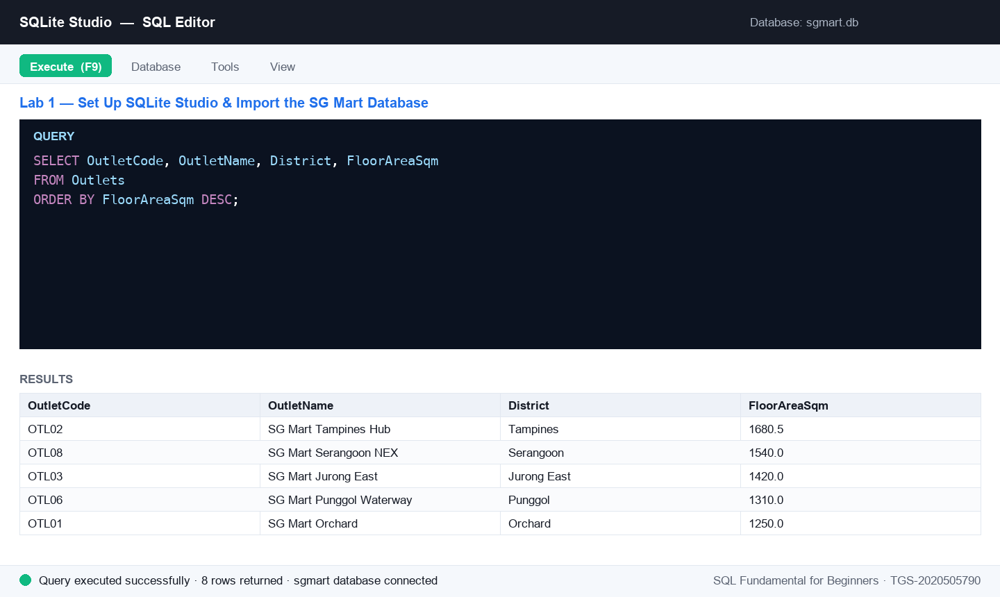

# Lab 1 — Set Up SQLite Studio & Import the SG Mart Database

**Topic 01 — Data Modeling** · SQL Fundamental for Beginners (TGS-2020505790)

**Objective:** LO1 — identify relevant data sources and set up the SQL workbench (A1, A2).

**Goal:** Install SQLite Studio, connect it to the SG Mart sample database and explore its tables — your data source for the whole course.

**You'll build:** A working SQLite Studio with the SG Mart database connected, showing the Outlets, Products and Categories tables.

**Tools:** SQLite Studio, sgmart.db mock database, LMS course materials



*Figure 1 — the SQL editor after running this lab's key statement.*

## Mock data for this lab

Everything this lab needs is in [`datasets/lab-01-set-up-sqlite-studio-import-the-sg-mart-database/`](datasets/lab-01-set-up-sqlite-studio-import-the-sg-mart-database/) — CSV files you can open in Excel, plus a seed script that creates and fills the tables in one go.

| Table | Rows | What it holds |
|---|---:|---|
| [`Outlets`](datasets/lab-01-set-up-sqlite-studio-import-the-sg-mart-database/Outlets.csv) | 8 | The 8 SG Mart retail outlets — code, name, planning area, postal sector, opening date and floor area. |
| [`Products`](datasets/lab-01-set-up-sqlite-studio-import-the-sg-mart-database/Products.csv) | 25 | 25 SKUs with cost, retail price, category, supplier and reorder level (some NULL). |
| [`Categories`](datasets/lab-01-set-up-sqlite-studio-import-the-sg-mart-database/Categories.csv) | 8 | 8 product categories grouped into Perishables, Packaged and Non-Food. |

**Quickest way to load it:** open [`datasets/lab-01-set-up-sqlite-studio-import-the-sg-mart-database/seed_sqlite.sql`](datasets/lab-01-set-up-sqlite-studio-import-the-sg-mart-database/seed_sqlite.sql) in the SQLite Studio SQL editor and execute the whole script. On MySQL or SQL Server use [`seed_mysql.sql`](datasets/lab-01-set-up-sqlite-studio-import-the-sg-mart-database/seed_mysql.sql) instead. The complete course dataset — including an Excel workbook and a prebuilt `sgmart.db` — is in [`datasets/_all/`](datasets/_all/).

## Steps

1. Download SQLite Studio for your OS from the official site and install it. (Alternative: use the free cloud version at sqliteonline.com — no install needed.)

   ```sql
   https://sqlitestudio.pl
   ```

2. Download the course mock data from the LMS. You want the datasets folder — it contains sgmart.db (a ready-built SQLite database), an Excel workbook and the CSV files.

   ```sql
   https://lms-tms.tertiaryinfotech.com
   ```

3. Open SQLite Studio, click Database → Add a database, browse to the downloaded sgmart.db and click OK.
4. In the left-hand Databases panel, right-click sgmart and choose Connect to the database.
5. Expand the database tree. You should see the SG Mart tables — Outlets, Categories, Suppliers, Products, Customers, Staff, Orders and OrderItems. Double-click Outlets and open the Data tab to preview its 8 rows.
6. Run your first query to confirm the connection works — list the retail outlets by floor area, largest first.

   ```sql
   SELECT OutletCode, OutletName, District, FloorAreaSqm
   FROM Outlets
   ORDER BY FloorAreaSqm DESC;
   ```

7. Open Outlets.csv from the datasets folder in Excel to see the same data as a spreadsheet. This is the raw form the business hands you before it becomes a table.

## Test it

The Databases panel shows the connected sgmart database with the Outlets, Products, Customers, Orders and OrderItems tables; the Data tab displays outlet rows; and the ORDER BY query returns 8 outlets led by SG Mart Tampines Hub (1680.5 sqm).
