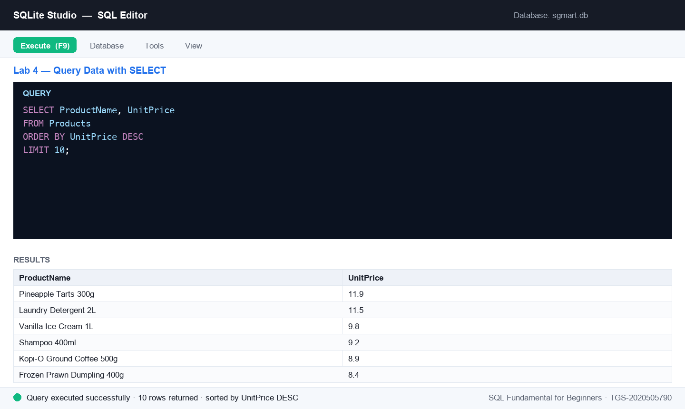

# Lab 4 — Query Data with SELECT

**Topic 02 — Data Processing and Analysis** · SQL Fundamental for Beginners (TGS-2020505790)

**Objective:** LO2 — apply data processing and analysis using SQL queries (A3, A5).

**Goal:** Query the SG Mart product catalogue with SELECT: retrieve all columns, chosen columns, distinct values and filtered rows, then combine sorting and limits to answer real merchandising questions.

**You'll build:** A set of working queries answering questions about SG Mart's products, categories and outlets.

**Tools:** SQLite Studio, sgmart database, lab-04 dataset



*Figure 4 — the SQL editor after running this lab's key statement.*

## Mock data for this lab

Everything this lab needs is in [`datasets/lab-04-query-data-with-select/`](datasets/lab-04-query-data-with-select/) — CSV files you can open in Excel, plus a seed script that creates and fills the tables in one go.

| Table | Rows | What it holds |
|---|---:|---|
| [`Products`](datasets/lab-04-query-data-with-select/Products.csv) | 25 | 25 SKUs with cost, retail price, category, supplier and reorder level (some NULL). |
| [`Categories`](datasets/lab-04-query-data-with-select/Categories.csv) | 8 | 8 product categories grouped into Perishables, Packaged and Non-Food. |
| [`Outlets`](datasets/lab-04-query-data-with-select/Outlets.csv) | 8 | The 8 SG Mart retail outlets — code, name, planning area, postal sector, opening date and floor area. |

**Quickest way to load it:** open [`datasets/lab-04-query-data-with-select/seed_sqlite.sql`](datasets/lab-04-query-data-with-select/seed_sqlite.sql) in the SQLite Studio SQL editor and execute the whole script. On MySQL or SQL Server use [`seed_mysql.sql`](datasets/lab-04-query-data-with-select/seed_mysql.sql) instead. The complete course dataset — including an Excel workbook and a prebuilt `sgmart.db` — is in [`datasets/_all/`](datasets/_all/).

## Steps

1. In the sgmart database's SQL editor, retrieve every row and column of Products, then only the columns a price list needs.

   ```sql
   SELECT * FROM Products;
   SELECT ProductName, UnitPrice FROM Products;
   ```

2. List each category code just once with SELECT DISTINCT — how many distinct categories does the range span?

   ```sql
   SELECT DISTINCT CategoryCode FROM Products;
   ```

3. Filter rows with WHERE — every product supplied by Lion City Beverages (SUP05).

   ```sql
   SELECT SKU, ProductName, UnitPrice
   FROM Products
   WHERE SupplierID = 'SUP05';
   ```

4. Answer: what are the 10 most expensive products, dearest first?

   ```sql
   SELECT ProductName, UnitPrice
   FROM Products
   ORDER BY UnitPrice DESC
   LIMIT 10;
   ```

5. Answer: which 5 outlets have the largest floor area, and in which district?

   ```sql
   SELECT OutletName, District, FloorAreaSqm
   FROM Outlets
   ORDER BY FloorAreaSqm DESC
   LIMIT 5;
   ```

6. Combine a filter with a sort — active products under $5, cheapest first. This is the query a promotions planner actually runs.

   ```sql
   SELECT ProductName, UnitPrice, CategoryCode
   FROM Products
   WHERE IsActive = 1
     AND UnitPrice < 5.00
   ORDER BY UnitPrice;
   ```


## Test it

Each query runs without error; the DISTINCT query returns 8 category codes; the top-10 price query is led by Pineapple Tarts 300g at $11.90; and the largest outlet is SG Mart Tampines Hub (1680.5 sqm).
