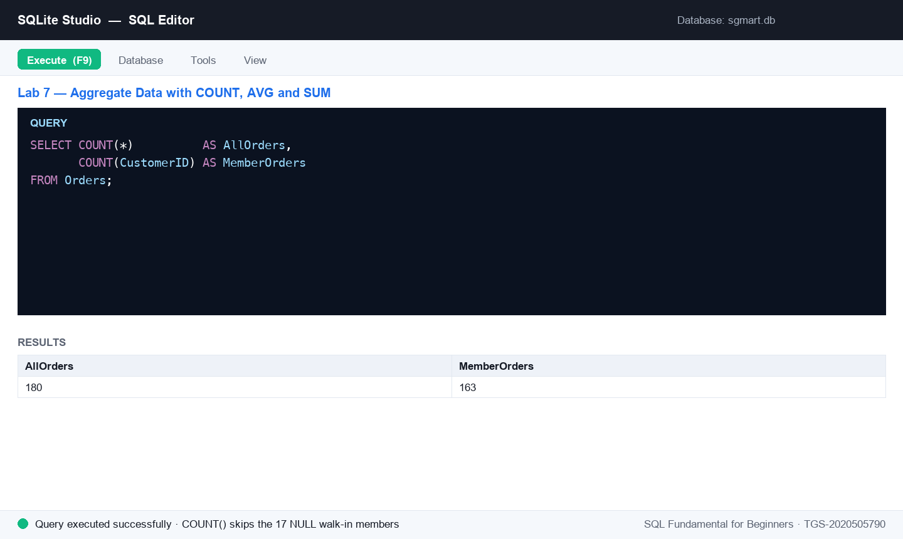

# Lab 7 — Aggregate Data with COUNT, AVG and SUM

**Topic 03 — Data Transformation** · SQL Fundamental for Beginners (TGS-2020505790)

**Objective:** LO3 — transform data with aggregate functions (A4, A6).

**Goal:** Summarise SG Mart's sales with COUNT, AVG, SUM, MIN and MAX: count transactions, average basket values, total revenue, and combine aggregates with DISTINCT and WHERE to answer real management questions.

**You'll build:** A management summary of SG Mart trading — order counts, average and total revenue, and filtered aggregate answers.

**Tools:** SQLite Studio, sgmart database, lab-07 dataset



*Figure 7 — the SQL editor after running this lab's key statement.*

## Mock data for this lab

Everything this lab needs is in [`datasets/lab-07-aggregate-data-with-count-avg-and-sum/`](datasets/lab-07-aggregate-data-with-count-avg-and-sum/) — CSV files you can open in Excel, plus a seed script that creates and fills the tables in one go.

| Table | Rows | What it holds |
|---|---:|---|
| [`Orders`](datasets/lab-07-aggregate-data-with-count-avg-and-sum/Orders.csv) | 180 | 180 sales orders across 2025 — outlet, member (NULL for walk-ins), cashier, channel, payment and status. |
| [`OrderItems`](datasets/lab-07-aggregate-data-with-count-avg-and-sum/OrderItems.csv) | 685 | Order lines (the fact table) — quantity, unit price, discount and line total. Makes SUM/AVG/GROUP BY meaningful. |
| [`Products`](datasets/lab-07-aggregate-data-with-count-avg-and-sum/Products.csv) | 25 | 25 SKUs with cost, retail price, category, supplier and reorder level (some NULL). |

**Quickest way to load it:** open [`datasets/lab-07-aggregate-data-with-count-avg-and-sum/seed_sqlite.sql`](datasets/lab-07-aggregate-data-with-count-avg-and-sum/seed_sqlite.sql) in the SQLite Studio SQL editor and execute the whole script. On MySQL or SQL Server use [`seed_mysql.sql`](datasets/lab-07-aggregate-data-with-count-avg-and-sum/seed_mysql.sql) instead. The complete course dataset — including an Excel workbook and a prebuilt `sgmart.db` — is in [`datasets/_all/`](datasets/_all/).

## Steps

1. Count the rows in Orders — how many transactions did SG Mart record in 2025?

   ```sql
   SELECT COUNT(*) AS TotalOrders FROM Orders;
   ```

2. COUNT ignores NULLs, and that is useful. Compare these two — the difference is the walk-in customers with no membership.

   ```sql
   SELECT COUNT(*)          AS AllOrders,
          COUNT(CustomerID) AS MemberOrders
   FROM Orders;
   ```

3. Average a numeric column — the mean value of a sales line.

   ```sql
   SELECT ROUND(AVG(LineTotal), 2) AS AvgLineValue
   FROM OrderItems;
   ```

4. Total a numeric column — SG Mart's full-year revenue.

   ```sql
   SELECT ROUND(SUM(LineTotal), 2) AS TotalRevenue
   FROM OrderItems;
   ```

5. MIN and MAX bracket the range — the cheapest and dearest thing on the shelf.

   ```sql
   SELECT MIN(UnitPrice) AS Cheapest,
          MAX(UnitPrice) AS Dearest
   FROM Products;
   ```

6. Answer: how many distinct payment methods do customers actually use?

   ```sql
   SELECT COUNT(DISTINCT PaymentMethod) AS PaymentMethods
   FROM Orders;
   ```

7. Answer: how many orders were completed, as opposed to refunded or cancelled?

   ```sql
   SELECT COUNT(*) AS CompletedOrders
   FROM Orders
   WHERE Status = 'Completed';
   ```

8. Put it together — the average basket for online orders only, rounded to cents.

   ```sql
   SELECT ROUND(AVG(oi.LineTotal), 2) AS AvgOnlineLine,
          COUNT(*)                    AS OnlineLines
   FROM Orders o
   INNER JOIN OrderItems oi ON o.OrderID = oi.OrderID
   WHERE o.Channel = 'Online';
   ```


## Test it

COUNT(*) returns 180 orders while COUNT(CustomerID) returns 163 (17 walk-ins are NULL); average line value is 13.48; total revenue is 9231.43; prices range from 2.10 to 11.90; and there are 5 distinct payment methods with 165 completed orders.
