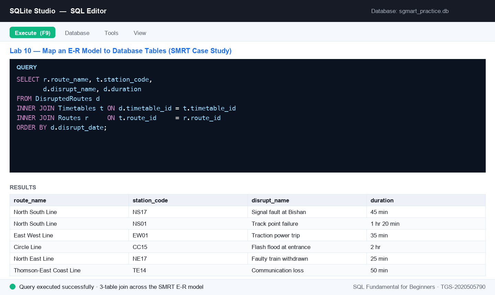

# Lab 10 — Map an E-R Model to Database Tables (SMRT Case Study)

**Topic 04 — Introduction to Data Warehouse** · SQL Fundamental for Beginners (TGS-2020505790)

**Objective:** LO4 — apply data mapping from an E-R model to a data warehouse schema (A7, A8, A9).

**Goal:** Take the SMRT public-transport E-R model (Routes, Stations, Timetables, DisruptedRoutes) and map it to physical tables: create each entity with its primary key, wire the foreign-key relationships, load the mock operational data and verify the model with joined queries.

**You'll build:** A four-table transport schema in SQLite that faithfully implements the SMRT E-R model with PK/FK mappings, loaded with real-shaped route, timetable and disruption data.

**Tools:** SQLite Studio, sgmart_practice database, lab-10 dataset (Routes, Stations, Timetables, DisruptedRoutes)



*Figure 10 — the SQL editor after running this lab's key statement.*

## Mock data for this lab

Everything this lab needs is in [`datasets/lab-10-map-an-e-r-model-to-database-tables-smrt-case-st/`](datasets/lab-10-map-an-e-r-model-to-database-tables-smrt-case-st/) — CSV files you can open in Excel, plus a seed script that creates and fills the tables in one go.

| Table | Rows | What it holds |
|---|---:|---|
| [`Routes`](datasets/lab-10-map-an-e-r-model-to-database-tables-smrt-case-st/Routes.csv) | 8 | 8 SMRT routes (6 MRT lines + 2 bus services) — the parent entity of the transport E-R model. |
| [`Stations`](datasets/lab-10-map-an-e-r-model-to-database-tables-smrt-case-st/Stations.csv) | 14 | 14 MRT stations with line position, interchange flag and opening date. |
| [`Timetables`](datasets/lab-10-map-an-e-r-model-to-database-tables-smrt-case-st/Timetables.csv) | 42 | 42 timetable rows — first/last trip and frequency per station for weekday, Saturday and Sunday/PH. |
| [`DisruptedRoutes`](datasets/lab-10-map-an-e-r-model-to-database-tables-smrt-case-st/DisruptedRoutes.csv) | 6 | 6 service disruptions in 2025 — type, details, start time, duration and the alternative arrangements offered. |

**Quickest way to load it:** open [`datasets/lab-10-map-an-e-r-model-to-database-tables-smrt-case-st/seed_sqlite.sql`](datasets/lab-10-map-an-e-r-model-to-database-tables-smrt-case-st/seed_sqlite.sql) in the SQLite Studio SQL editor and execute the whole script. On MySQL or SQL Server use [`seed_mysql.sql`](datasets/lab-10-map-an-e-r-model-to-database-tables-smrt-case-st/seed_mysql.sql) instead. The complete course dataset — including an Excel workbook and a prebuilt `sgmart.db` — is in [`datasets/_all/`](datasets/_all/).

## Steps

1. Review the E-R model before writing any SQL. Routes (route_id PK) 1—many Stations and 1—many Timetables (timetable_id PK, route_id FK); Timetables 1—many DisruptedRoutes (disrupt_no PK, timetable_id FK). Identify each entity's attributes, its primary key, and which column carries the relationship.
2. Create the Routes parent table — the 6 MRT lines and 2 bus services.

   ```sql
   DROP TABLE IF EXISTS Routes;
   CREATE TABLE Routes (
     route_id        CHARACTER(4) NOT NULL PRIMARY KEY,
     route_type      CHARACTER(15) NOT NULL,
     route_code      VARCHAR(3) NOT NULL,
     route_name      VARCHAR(125) NOT NULL,
     route_direction CHARACTER(10) NOT NULL,
     remarks         VARCHAR(255)
   );
   ```

3. Create the Stations table — each station belongs to one route, so route_id is a FOREIGN KEY.

   ```sql
   DROP TABLE IF EXISTS Stations;
   CREATE TABLE Stations (
     station_code   CHARACTER(4) NOT NULL PRIMARY KEY,
     station_name   VARCHAR(40) NOT NULL,
     route_id       CHARACTER(4) NOT NULL,
     line_position  INTEGER NOT NULL,
     is_interchange INTEGER NOT NULL DEFAULT 0,
     opened_date    DATE,
     FOREIGN KEY (route_id) REFERENCES Routes(route_id)
   );
   ```

4. Create the Timetables child table — first and last trip per station for each service pattern.

   ```sql
   DROP TABLE IF EXISTS Timetables;
   CREATE TABLE Timetables (
     timetable_id   INTEGER NOT NULL PRIMARY KEY,
     route_id       CHARACTER(4) NOT NULL,
     station_code   CHARACTER(4) NOT NULL,
     frequency      VARCHAR(20) DEFAULT '',
     days_operation VARCHAR(30) NOT NULL,
     stop_no        NUMERIC(3) NOT NULL,
     first_trip     CHAR(10) NOT NULL,
     last_trip      CHAR(10) NOT NULL,
     FOREIGN KEY (route_id) REFERENCES Routes(route_id)
   );
   ```

5. Create the DisruptedRoutes table — its timetable_id references Timetables, completing the chain.

   ```sql
   DROP TABLE IF EXISTS DisruptedRoutes;
   CREATE TABLE DisruptedRoutes (
     disrupt_no      INTEGER NOT NULL PRIMARY KEY,
     disrupt_date    DATE NOT NULL,
     disrupt_type    VARCHAR(20) NOT NULL,
     disrupt_name    VARCHAR(50) NOT NULL,
     disrupt_details VARCHAR(300) NOT NULL,
     start_datetime  CHAR(12) NOT NULL,
     duration        CHAR(20) NOT NULL,
     timetable_id    INTEGER NOT NULL,
     alternatives    VARCHAR(3000) NOT NULL,
     FOREIGN KEY (timetable_id) REFERENCES Timetables(timetable_id)
   );
   ```

6. Load the operational data: open seed_sqlite.sql from this lab's dataset folder and execute it. It fills all four tables — 8 routes, 14 stations, 42 timetable rows and 6 recorded disruptions.
7. Verify the parent table loaded and the model reads correctly.

   ```sql
   SELECT route_id, route_code, route_name, route_type
   FROM Routes
   ORDER BY route_id;
   ```

8. Walk one relationship — every station on the North South Line, in line order.

   ```sql
   SELECT s.station_code, s.station_name, s.line_position, s.is_interchange
   FROM Stations s
   INNER JOIN Routes r ON s.route_id = r.route_id
   WHERE r.route_code = 'NSL'
   ORDER BY s.line_position;
   ```

9. Verify the mapping end-to-end: join all the way from a disruption back to its route.

   ```sql
   SELECT r.route_name,
          t.station_code,
          t.days_operation,
          d.disrupt_name,
          d.duration
   FROM DisruptedRoutes d
   INNER JOIN Timetables t ON d.timetable_id = t.timetable_id
   INNER JOIN Routes     r ON t.route_id     = r.route_id
   ORDER BY d.disrupt_date;
   ```

10. Now analyse it like a warehouse would — which route type suffers the most disruptions?

   ```sql
   SELECT r.route_name,
          COUNT(d.disrupt_no) AS Disruptions
   FROM Routes r
   LEFT JOIN Timetables      t ON r.route_id     = t.route_id
   LEFT JOIN DisruptedRoutes d ON t.timetable_id = d.timetable_id
   GROUP BY r.route_name
   ORDER BY Disruptions DESC;
   ```


## Test it

The four tables exist with their PK/FK constraints visible in the DDL; Routes returns 8 rows; the NSL station query returns 4 stations in line order; the three-way join returns the 6 disruptions each linked to a route and station; and the LEFT JOIN summary lists every route including those with zero disruptions.
