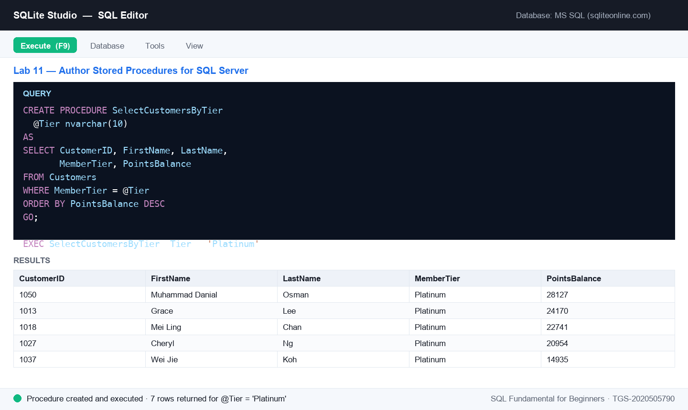

# Lab 11 — Author Stored Procedures for SQL Server

**Topic 04 — Introduction to Data Warehouse** · SQL Fundamental for Beginners (TGS-2020505790)

**Objective:** LO4 — operate data-warehouse platform capabilities with reusable stored procedures (A7, A8, A9).

**Goal:** Write stored procedures in SQL Server syntax against the SG Mart data — a plain procedure and a parameterised one — and understand where they run (SQL Server / MySQL, not SQLite) and why warehouses use them for repeatable batch work.

**You'll build:** Stored-procedure scripts (plain and parameterised) ready to run on SQL Server, plus the EXEC calls that invoke them.

**Tools:** SQL Editor, SQL Server syntax (sqliteonline.com's MS SQL engine, or any SQL Server), lab-11 dataset (seed_mysql.sql)



*Figure 11 — the SQL editor after running this lab's key statement.*

## Mock data for this lab

Everything this lab needs is in [`datasets/lab-11-author-stored-procedures-for-sql-server/`](datasets/lab-11-author-stored-procedures-for-sql-server/) — CSV files you can open in Excel, plus a seed script that creates and fills the tables in one go.

| Table | Rows | What it holds |
|---|---:|---|
| [`Customers`](datasets/lab-11-author-stored-procedures-for-sql-server/Customers.csv) | 60 | 60 loyalty members — tier, join date, points, birth year (some NULL) and home district. |
| [`Orders`](datasets/lab-11-author-stored-procedures-for-sql-server/Orders.csv) | 180 | 180 sales orders across 2025 — outlet, member (NULL for walk-ins), cashier, channel, payment and status. |
| [`Outlets`](datasets/lab-11-author-stored-procedures-for-sql-server/Outlets.csv) | 8 | The 8 SG Mart retail outlets — code, name, planning area, postal sector, opening date and floor area. |

**Quickest way to load it:** open [`datasets/lab-11-author-stored-procedures-for-sql-server/seed_sqlite.sql`](datasets/lab-11-author-stored-procedures-for-sql-server/seed_sqlite.sql) in the SQLite Studio SQL editor and execute the whole script. On MySQL or SQL Server use [`seed_mysql.sql`](datasets/lab-11-author-stored-procedures-for-sql-server/seed_mysql.sql) instead. The complete course dataset — including an Excel workbook and a prebuilt `sgmart.db` — is in [`datasets/_all/`](datasets/_all/).

## Steps

1. Stored procedures are not available in SQLite — author these against SQL Server. Free option: open sqliteonline.com and switch the engine to MS SQL. Load this lab's seed_mysql.sql to create the Customers, Orders and Outlets tables with the SG Mart data.
2. A stored procedure is a named, saved SQL script the server keeps for you. Write one that returns all members, then run it to save it.

   ```sql
   CREATE PROCEDURE SelectAllCustomers
   AS
   SELECT CustomerID, FirstName, LastName, MemberTier, PointsBalance
   FROM Customers
   GO;
   ```

3. Execute the stored procedure by name — no need to retype the query.

   ```sql
   EXEC SelectAllCustomers;
   ```

4. Write a parameterised version that filters members by tier through a @Tier parameter. Parameters are what make a procedure reusable.

   ```sql
   CREATE PROCEDURE SelectCustomersByTier
     @Tier nvarchar(10)
   AS
   SELECT CustomerID, FirstName, LastName, MemberTier, PointsBalance
   FROM Customers
   WHERE MemberTier = @Tier
   ORDER BY PointsBalance DESC
   GO;
   ```

5. Execute it, passing the parameter value — then run it again with a different tier to see the same procedure answer a different question.

   ```sql
   EXEC SelectCustomersByTier @Tier = 'Platinum';
   EXEC SelectCustomersByTier @Tier = 'Gold';
   ```

6. Write a procedure with two parameters — the pattern a nightly warehouse job would use to extract one outlet's takings for a date range.

   ```sql
   CREATE PROCEDURE OutletSalesByPeriod
     @Outlet nvarchar(5),
     @FromDate date
   AS
   SELECT o.OutletCode,
          COUNT(*)      AS Orders,
          MAX(o.OrderDate) AS LatestOrder
   FROM Orders o
   WHERE o.OutletCode = @Outlet
     AND o.OrderDate >= @FromDate
   GROUP BY o.OutletCode
   GO;
   ```

7. Run the two-parameter procedure.

   ```sql
   EXEC OutletSalesByPeriod @Outlet = 'OTL08', @FromDate = '2025-07-01';
   ```

8. Discuss: why do data warehouses rely on stored procedures? They centralise the logic, run close to the data (no network round-trips), can be granted to users without exposing the base tables, and give you one place to change a rule.

## Test it

All three procedures create without error; EXEC SelectAllCustomers returns the full 60-member list; EXEC SelectCustomersByTier @Tier = 'Platinum' returns only the 7 Platinum members ordered by points; and the two-parameter procedure returns one summary row for OTL08.
